# 📖 Flutter Book App - Booksum

A **Flutter-powered** book reading application that leverages **Riverpod** for state management, offering a seamless and feature-rich reading experience.  

## ✨ Features  

- 📊 **Reading Statistics** – Track total reading time, daily progress, and session history.  
- 📚 **Book Library** – View a list of added books with details.  
- 📖 **Latest Read Book** – Quickly access the most recently read book.  
- ➕ **Add New Books** – Upload books in **PDF format** to the library.  
- 🔍 **Book Viewer** – Read books with smooth PDF rendering.  
- 🖍️ **Highlight & Notes** – Mark important text and add personal notes.  
- 🔖 **Bookmarks** – Save specific pages for quick reference.  

## 🛠️ Tech Stack  

- **Flutter** – UI Framework  
- **Riverpod** – State Management  
- **Dart** – Programming Language  
- **pdfrx** – PDF Rendering  
- **Path Provider** – Local Storage

## 📸 Screenshots

### 📌 Home & Book Management  
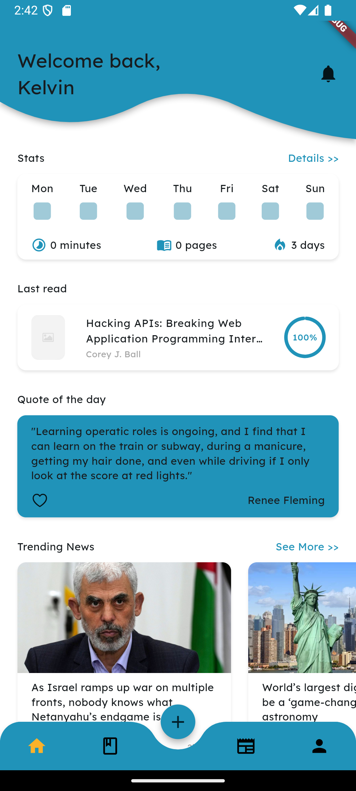  
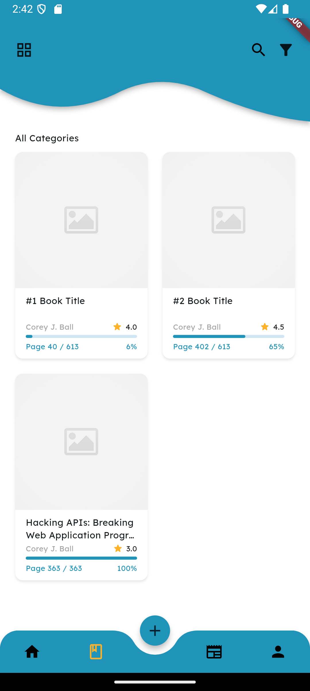  
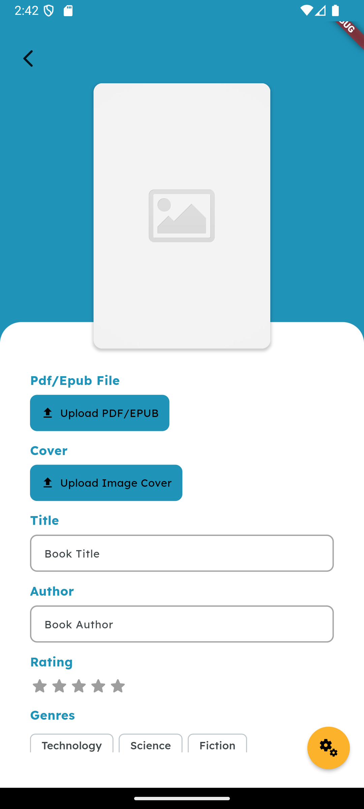  
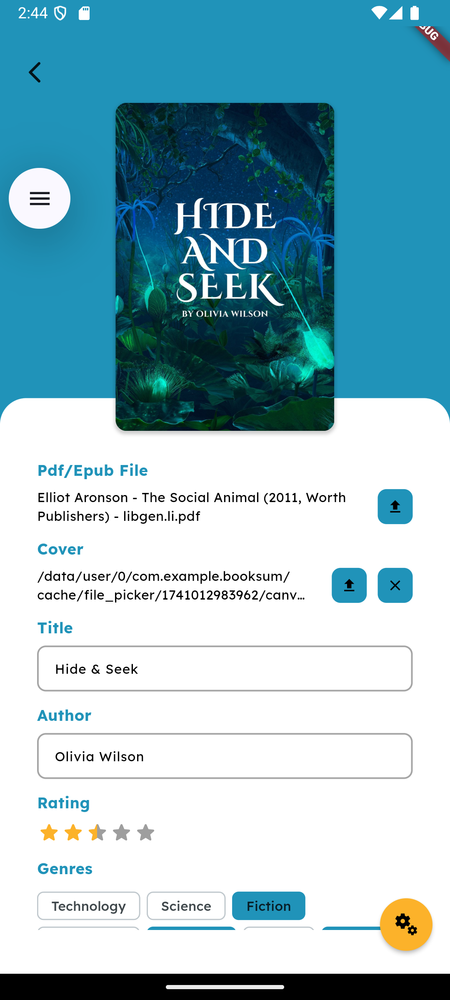  
  
  
  

### 📖 Reading & PDF Features  
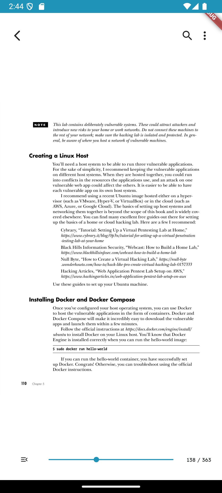  
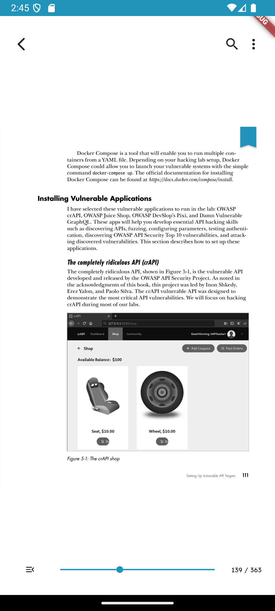  
  
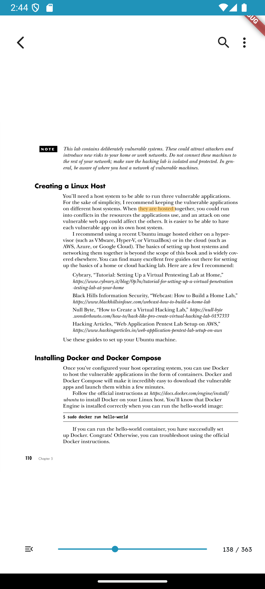  
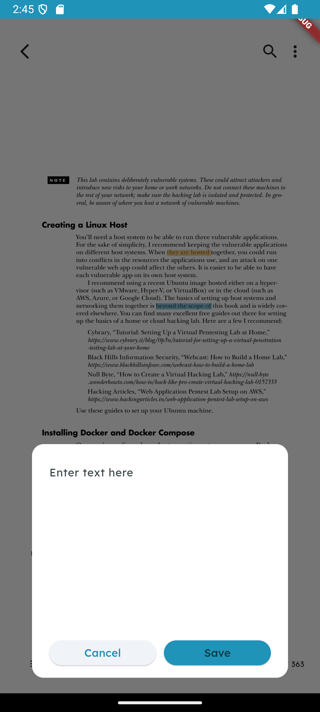  
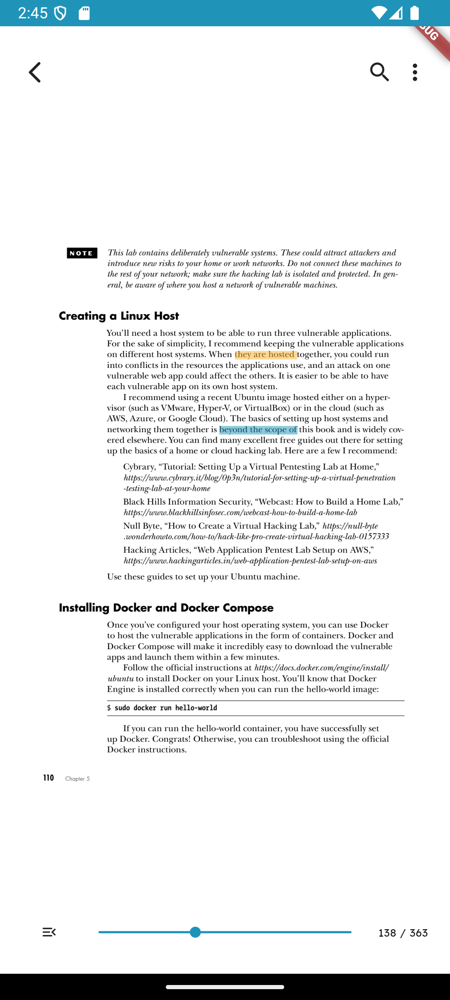  

### 📑 Organization & Notes  
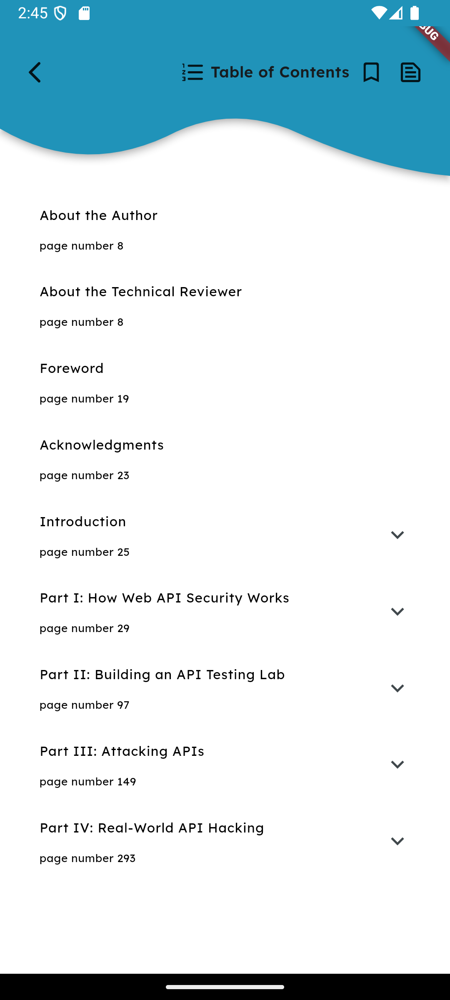  
  
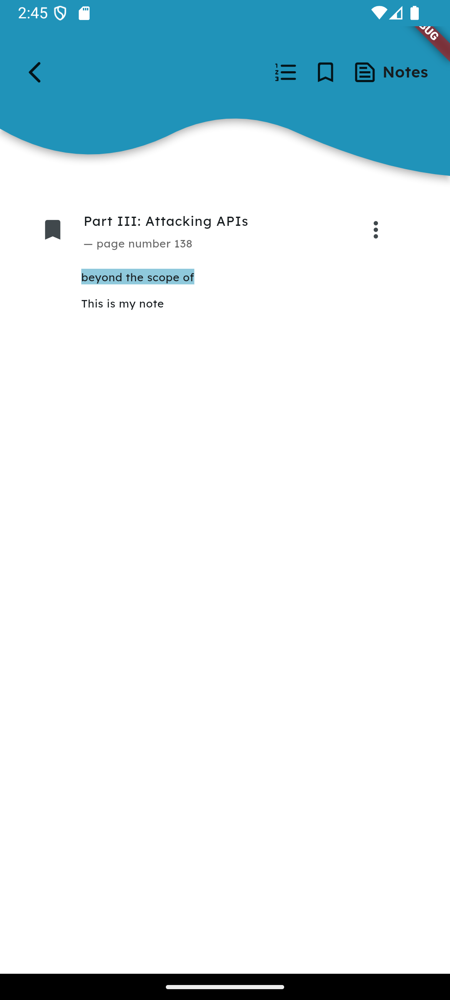  

## 🚀 Getting Started

### Prerequisites  
Ensure you have Flutter installed.

git clone https://github.com/hohkokyoung/flutter-book-app.git
cd booksum
flutter pub get
flutter run